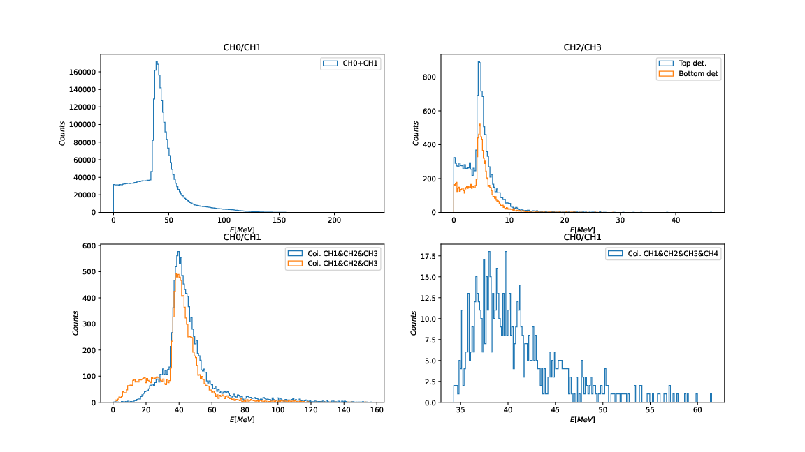

# Muon Detector - simulation

## Installation

`mkdir build && cd build`

`cmake -DGeant4=<path to g4 installation folder> <path to simulation source>`

`make -j2`

## Starting simulation

`./muon_run <optional macro file>`

